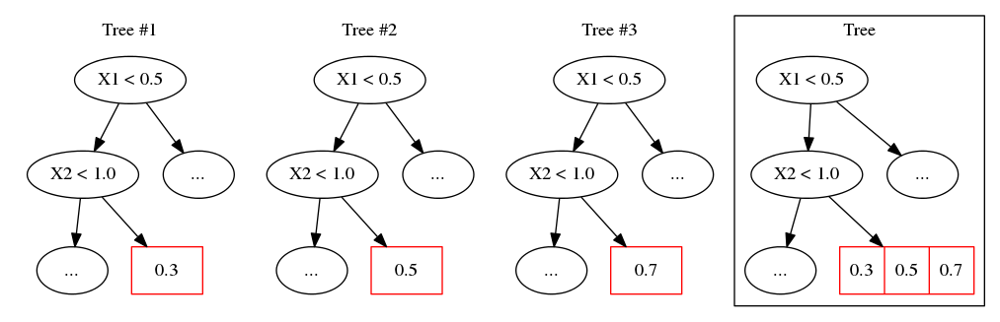
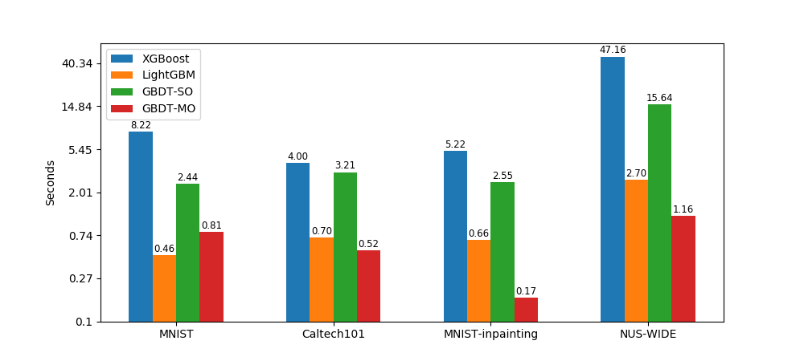

# GBDT-MO: Gradient Boosted Decision Tree for Multiple Outputs


# Important Updates
- 2021.03.09: the implementation for updating multi-output histograms is problematic. Now it has been corrected. Please check `src/dataStruct.h` for details. This improves the convergence speed. Experiment results are slightly different (generally better) than the old one.

## Introduction
Gradient boosted decision tree (GBDT) is a popular machine learning algorithm. Current open-sourced GBDT implementations are mainly designed for single output. When there are multiple outputs, they build multiple trees each of which corresponds to an output variable. Such a strategy ignores the correlations between output variables which leads to **worse generalization ability and tree redundancy**.

To address this problem, we propose a general method to learn GBDT for multiple outputs (GBDT-MO). Each leaf of GBDT-MO constructs the predictions of all variables or a subset of automatically selected variables. Experiments show that GBDT-MO has **better generalization ability and faster training and inference speed** than GBDT for single output. 

GBDT-MO suffers from slow convergence (requires more boost rounds). It should be improved in the future.

## Implementations
We implement GBDT-MO from scratch by C++. And we provide a Python interface. Our implementations are similar to LightGBM except the learning mechanisms designed for multiple outputs. Some advanced features are not included, such as GPU training and distributed training. This project is only tested on Linux and used for academic explorations currently.

## Installation
First, clone this project and compile the C++ source code:
```
dos2unix make.sh
bash make.sh
```
The shared library will be generated in:
```
build/gbdtmo.so
```
Then, install the Python package:
```
pip install .
```

## Results
We show test performance on six real-world datasets. Here, GBDT-SO is our own implementation of GBDT for single output.

|  Dataset | MNIST              | Yeast              | Caltech101         | NUS\-WIDE          | MNIST\-inpaining     |
|:----------------------:|:--------------------:|:--------------------:|:--------------------:|:--------------------:|:----------------------:|
|  Metric    | accuracy           | accuracy           | accuracy           | top\-1 accuracy    | RMSE                 |
| XGBoost                | 97\.86             | **62\.94** | 56\.52             | 43\.72             | 0\.26088             |
| LightGBM              | 98\.03             | 61\.97             | 55\.94             | 43\.99             | 0\.26090       |
| GBDT\-sparse       | 96\.41             | 62\.83             | 43\.93             | 44\.05             | \-                |
| GBDT\-SO              | 98\.08             | 61\.97             | 56\.62             | 44\.10             | 0\.26157       |
| GBDT\-MO            | **98\.30** | 62\.29             | **57\.49** | **44\.21** | **0\.26025** |

We show training time averaged by rounds in log scale. 


We show inference time on test set averaged by rounds (millisecond).

|  Dataset       | MNIST       | Caltech101         | NUS\-WIDE          | MNIST\-inpaining     |
|:--------------:|:-----------:|:------------------:|:------------------:|:--------------------:|
| XGBoost        | 6\.38       |  9\.57             | 119\.24            | 6\.61                |
| LightGBM       | 1\.78       |  2\.76             | 209\.79            | 8\.50                |
| GBDT\-SO       | 3\.77       |  4\.70             | 515\.90            | 12\.75               |
| GBDT\-MO       | **0\.59**   |**0\.15**           | **7\.83**          | **0\.32**            |


## Links

* For algorithm and experiment details, refer our [paper](https://arxiv.org/abs/1909.04373).
* For examples or reproducing the results, refer [GBDTMO-EX](https://github.com/zzd1992/GBDTMO-EX).
* For instructions, refer our [documentation](https://gbdtmo.readthedocs.io).

